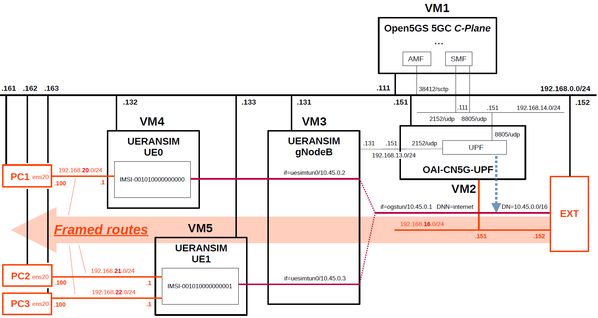

# Open5GS 5GC & UERANSIM UE / RAN Sample Configuration - Framed Routing with OAI-CN5G-UPF(AF_PACKET)
This describes a very simple configuration that uses Open5GS, OAI-CN5G-UPF and UERANSIM for Framed Routing.

This feature has been merged into Open5GS via the following pull requests by **@mitmitmitm**.

- [Framed routing](https://github.com/open5gs/open5gs/pull/2009)
- [Framed routes udr](https://github.com/open5gs/open5gs/pull/2022)
- [[SMF/PFCP] Send framed routes in both UL and DL pdrs](https://github.com/open5gs/open5gs/pull/2356)

The related documents can be found below.
- https://github.com/gonalobastos/5G-Framed-Routing

---

### [Sample Configurations and Miscellaneous for Mobile Network](https://github.com/s5uishida/sample_config_misc_for_mobile_network)

---

<a id="toc"></a>

## Table of Contents

- [Overview of Open5GS 5GC Simulation Mobile Network](#overview)
- [Changes in configuration files of Open5GS 5GC, OAI-CN5G-UPF and UERANSIM UE / RAN](#changes)
  - [Changes in configuration files of Open5GS 5GC C-Plane](#changes_cp)
  - [Changes in configuration files of OAI-CN5G-UPF](#changes_up)
  - [Changes in configuration files of UERANSIM UE / RAN](#changes_ueransim)
    - [Changes in configuration files of RAN](#changes_ran)
    - [Changes in configuration files of UE0 (IMSI-001010000000000)](#changes_ue0)
    - [Changes in configuration files of UE1 (IMSI-001010000000001)](#changes_ue1)
- [Network settings of Open5GS 5GC, OAI-CN5G-UPF and UERANSIM UE / RAN](#network_settings)
  - [Network settings of OAI-CN5G-UPF](#network_settings_up)
  - [Network settings of External Node](#network_settings_ext)
  - [Network settings of UERANSIM RAN](#network_settings_gnb)
  - [Network settings of UERANSIM UE0](#network_settings_ue0)
  - [Network settings of UERANSIM UE1](#network_settings_ue1)
  - [Network settings of PC1 (Internal Node)](#network_settings_pc1)
  - [Network settings of PC2 (Internal Node)](#network_settings_pc2)
  - [Network settings of PC3 (Internal Node)](#network_settings_pc3)
- [Add Framed Routes to Subscriber information](#add_framed_routes)
  - [Add Framed Routes to UE0](#add_framed_routes_ue0)
  - [Add Framed Routes to UE1](#add_framed_routes_ue1)
- [Build Open5GS, OAI-CN5G-UPF and UERANSIM](#build)
- [Run Open5GS 5GC, OAI-CN5G-UPF and UERANSIM UE / RAN](#run)
  - [Run Open5GS 5GC C-Plane](#run_cp)
  - [Run OAI-CN5G-UPF](#run_up)
  - [Run UERANSIM](#run_ueran)
    - [Start gNodeB](#start_gnb)
    - [Start UE0](#start_ue0)
    - [Start UE1](#start_ue1)
  - [Run tcpdump on PC1](#run_pc1)
  - [Run tcpdump on PC2](#run_pc2)
  - [Run tcpdump on PC3](#run_pc3)
- [Ping Framed Routes](#ping)
  - [Ping IP address (192.168.20.100/24) of Framed Routes of UE0 on PC1](#ping_ue0)
  - [Ping IP address (192.168.21.100/24) of Framed Routes of UE1 on PC2](#ping_ue11)
  - [Ping IP address (192.168.22.100/24) of Framed Routes of UE1 on PC3](#ping_ue12)
  - [Ping IP address (192.168.23.100/24) of Framed Routes (not exist)](#ping_ue2)
- [Changelog (summary)](#changelog)
---
<a id="overview"></a>

## Overview of Open5GS 5GC Simulation Mobile Network

I created a 5GC simulation mobile network for  the purpose of using  the IP routes (Framed Routes) behind the UE.

The following minimum configuration was set as a condition.
- Two UEs have the same DNN and connect to the same DN.
- Two UEs have different Framed Routes. On the UPF VM, make sure to be able to ping the Framed Routes via the IP address (Tunnel GW/uesimtun0) assigned to each UE.

The built simulation environment is as follows.

</img>

The 5GC / UE / RAN used are as follows.
- 5GC - Open5GS v2.7.6 (2026.01.17) - https://github.com/open5gs/open5gs
- UPF - OAI-CN5G-UPF v2.2.0 (2025.12.13) - https://gitlab.eurecom.fr/oai/cn5g/oai-cn5g-upf
- UE / RAN - UERANSIM v3.2.7 (2025.10.25) - https://github.com/aligungr/UERANSIM

Each VMs are as follows.  
| VM # | SW & Role | IP address | OS | Mem (Min) | HDD (Min) |
| --- | --- | --- | --- | --- | --- |
| VM1 | Open5GS 5GC C-Plane | 192.168.0.111/24<br>192.168.14.111/24 | Ubuntu 24.04 | 2GB | 20GB |
| VM2 | OAI-CN5G-UPF U-Plane  | 192.168.0.151/24<br>192.168.13.151/24<br>192.168.14.151/24<br>**192.168.16.151/24** | Ubuntu 24.04 | 1GB | 20GB |
| EXT | External Node | 192.168.0.152/24<br>**192.168.16.152/24** | Ubuntu 24.04 | 1GB | 10GB |
| VM3 | UERANSIM RAN (gNodeB) | 192.168.0.131/24<br>192.168.13.131/24 | Ubuntu 24.04 | 1GB | 10GB |
| VM4 | UERANSIM UE0 | 192.168.0.132/24<br>**192.168.20.1/24** | Ubuntu 24.04 | 1GB | 10GB |
| VM5 | UERANSIM UE1 | 192.168.0.133/24<br>**192.168.21.1/24<br>192.168.22.1/24** | Ubuntu 24.04 | 1GB | 10GB |
| PC1 | Internal Node | 192.168.0.161/24<br>**192.168.20.100/24** | Ubuntu 24.04 | 1GB | 10GB |
| PC2 | Internal Node | 192.168.0.162/24<br>**192.168.21.100/24** | Ubuntu 24.04 | 1GB | 10GB |
| PC3 | Internal Node | 192.168.0.163/24<br>**192.168.22.100/24** | Ubuntu 24.04 | 1GB | 10GB |

Subscriber Information (other information is the same) is as follows.  
**Note. Please select OP or OPc according to the setting of UERANSIM UE configuration files. As of 2023.01.29, Framed Routes cannot be set with the WebUI. Also, if you change the `open5gs-dbctl` script, it seems that you can register these with this script, but I could not register.**
| UE # | IMSI | DNN | OP/OPc | Framed Routes | Internal IP address |
| --- | --- | --- | --- | --- | --- |
| UE0 | 001010000000000 | internet | OPc | **192.168.20.0/24** | **192.168.20.1** |
| UE1 | 001010000000001 | internet | OPc | **192.168.21.0/24<br>192.168.22.0/24** | **192.168.21.1<br>192.168.22.1** |

I registered these information with the Open5GS WebUI.
In addition, [3GPP TS 35.208](https://www.3gpp.org/DynaReport/35208.htm) "4.3 Test Sets" is published by 3GPP as test data for the 3GPP authentication and key generation functions (MILENAGE).

The DN is as follows.
| DN | TUNnel interface of DN | DNN | TUNnel interface of UE |
| --- | --- | --- | --- |
| 10.45.0.0/16 | ogstun | internet | uesimtun0 |

<a id="changes"></a>

## Changes in configuration files of Open5GS 5GC, OAI-CN5G-UPF and UERANSIM UE / RAN

Please refer to the following for building Open5GS, OAI-CN5G-UPF and UERANSIM respectively.
- Open5GS v2.7.6 (2026.01.17) - https://open5gs.org/open5gs/docs/guide/02-building-open5gs-from-sources/
- OAI-CN5G-UPF v2.2.0 (2025.12.13) - https://github.com/s5uishida/install_oai_upf
- UERANSIM v3.2.7 (2025.10.25) - https://github.com/aligungr/UERANSIM/wiki/Installation

<a id="changes_cp"></a>

### Changes in configuration files of Open5GS 5GC C-Plane

- `open5gs/install/etc/open5gs/amf.yaml`
```diff
--- amf.yaml.orig       2025-04-27 11:38:05.000000000 +0900
+++ amf.yaml    2025-11-20 07:31:25.166453278 +0900
@@ -20,27 +20,27 @@
         - uri: http://127.0.0.200:7777
   ngap:
     server:
-      - address: 127.0.0.5
+      - address: 192.168.0.111
   metrics:
     server:
       - address: 127.0.0.5
         port: 9090
   guami:
     - plmn_id:
-        mcc: 999
-        mnc: 70
+        mcc: 001
+        mnc: 01
       amf_id:
         region: 2
         set: 1
   tai:
     - plmn_id:
-        mcc: 999
-        mnc: 70
+        mcc: 001
+        mnc: 01
       tac: 1
   plmn_support:
     - plmn_id:
-        mcc: 999
-        mnc: 70
+        mcc: 001
+        mnc: 01
       s_nssai:
         - sst: 1
   security:
```
- `open5gs/install/etc/open5gs/nrf.yaml`
```diff
--- nrf.yaml.orig       2025-04-27 11:38:05.000000000 +0900
+++ nrf.yaml    2025-05-04 08:13:05.973154453 +0900
@@ -11,8 +11,8 @@
 nrf:
   serving:  # 5G roaming requires PLMN in NRF
     - plmn_id:
-        mcc: 999
-        mnc: 70
+        mcc: 001
+        mnc: 01
   sbi:
     server:
       - address: 127.0.0.10
```
- `open5gs/install/etc/open5gs/smf.yaml`
```diff
--- smf.yaml.orig       2025-01-15 04:12:06.000000000 +0900
+++ smf.yaml    2025-01-15 04:26:36.000000000 +0900
@@ -20,16 +20,14 @@
         - uri: http://127.0.0.200:7777
   pfcp:
     server:
-      - address: 127.0.0.4
+      - address: 192.168.14.111
     client:
       upf:
-        - address: 127.0.0.7
-  gtpc:
-    server:
-      - address: 127.0.0.4
+        - address: 192.168.14.151
+          dnn: internet
   gtpu:
     server:
-      - address: 127.0.0.4
+      - address: 192.168.14.111
   metrics:
     server:
       - address: 127.0.0.4
@@ -37,20 +35,17 @@
   session:
     - subnet: 10.45.0.0/16
       gateway: 10.45.0.1
-    - subnet: 2001:db8:cafe::/48
-      gateway: 2001:db8:cafe::1
+      dnn: internet
   dns:
     - 8.8.8.8
     - 8.8.4.4
-    - 2001:4860:4860::8888
-    - 2001:4860:4860::8844
   mtu: 1400
 #  p-cscf:
 #    - 127.0.0.1
 #    - ::1
 #  ctf:
 #    enabled: auto   # auto(default)|yes|no
-  freeDiameter: /root/open5gs/install/etc/freeDiameter/smf.conf
+#  freeDiameter: /root/open5gs/install/etc/freeDiameter/smf.conf
 
 ################################################################################
 # SMF Info
```

<a id="changes_up"></a>

### Changes in configuration files of OAI-CN5G-UPF

See [here](https://github.com/s5uishida/install_oai_upf#conf) for the original file.
And change this `config.yaml` to apply [AF_PACKET mode](https://github.com/s5uishida/install_oai_upf#af_conf) and [Framed Routing](https://github.com/s5uishida/install_oai_upf#fr).

<a id="changes_ueransim"></a>

### Changes in configuration files of UERANSIM UE / RAN

<a id="changes_ran"></a>

#### Changes in configuration files of RAN

- `UERANSIM/config/open5gs-gnb.yaml`
```diff
--- open5gs-gnb.yaml.orig       2023-12-02 06:14:20.000000000 +0900
+++ open5gs-gnb.yaml    2025-12-21 09:13:19.985091901 +0900
@@ -1,17 +1,17 @@
-mcc: '999'          # Mobile Country Code value
-mnc: '70'           # Mobile Network Code value (2 or 3 digits)
+mcc: '001'          # Mobile Country Code value
+mnc: '01'           # Mobile Network Code value (2 or 3 digits)
 
 nci: '0x000000010'  # NR Cell Identity (36-bit)
 idLength: 32        # NR gNB ID length in bits [22...32]
 tac: 1              # Tracking Area Code
 
-linkIp: 127.0.0.1   # gNB's local IP address for Radio Link Simulation (Usually same with local IP)
-ngapIp: 127.0.0.1   # gNB's local IP address for N2 Interface (Usually same with local IP)
-gtpIp: 127.0.0.1    # gNB's local IP address for N3 Interface (Usually same with local IP)
+linkIp: 192.168.0.131   # gNB's local IP address for Radio Link Simulation (Usually same with local IP)
+ngapIp: 192.168.0.131   # gNB's local IP address for N2 Interface (Usually same with local IP)
+gtpIp: 192.168.13.131    # gNB's local IP address for N3 Interface (Usually same with local IP)
 
 # List of AMF address information
 amfConfigs:
-  - address: 127.0.0.5
+  - address: 192.168.0.111
     port: 38412
 
 # List of supported S-NSSAIs by this gNB
```

<a id="changes_ue0"></a>

#### Changes in configuration files of UE0 (IMSI-001010000000000)

First, copy `open5gs-ue0.yaml` from `open5gs-ue.yaml`.
```
# cd UERANSIM/config
# cp open5gs-ue.yaml open5gs-ue0.yaml
```
Next, edit `open5gs-ue0.yaml`.
- `UERANSIM/config/open5gs-ue0.yaml`
```diff
--- open5gs-ue.yaml.orig        2025-03-16 15:49:12.000000000 +0900
+++ open5gs-ue0.yaml    2025-05-04 09:24:31.352554298 +0900
@@ -1,9 +1,9 @@
 # IMSI number of the UE. IMSI = [MCC|MNC|MSISDN] (In total 15 digits)
-supi: 'imsi-999700000000001'
+supi: 'imsi-001010000000000'
 # Mobile Country Code value of HPLMN
-mcc: '999'
+mcc: '001'
 # Mobile Network Code value of HPLMN (2 or 3 digits)
-mnc: '70'
+mnc: '01'
 # SUCI Protection Scheme : 0 for Null-scheme, 1 for Profile A and 2 for Profile B
 protectionScheme: 0
 # Home Network Public Key for protecting with SUCI Profile A
@@ -31,7 +31,7 @@
 
 # List of gNB IP addresses for Radio Link Simulation
 gnbSearchList:
-  - 127.0.0.1
+  - 192.168.0.131
 
 # UAC Access Identities Configuration
 uacAic:
```

<a id="changes_ue1"></a>

#### Changes in configuration files of UE1 (IMSI-001010000000001)

First, copy `open5gs-ue1.yaml` from `open5gs-ue.yaml`.
```
# cd UERANSIM/config
# cp open5gs-ue.yaml open5gs-ue1.yaml
```
Next, edit `open5gs-ue1.yaml`.
- `UERANSIM/config/open5gs-ue1.yaml`
```diff
--- open5gs-ue.yaml.orig        2025-03-16 15:49:12.000000000 +0900
+++ open5gs-ue1.yaml    2025-11-21 20:15:31.242725049 +0900
@@ -1,9 +1,9 @@
 # IMSI number of the UE. IMSI = [MCC|MNC|MSISDN] (In total 15 digits)
-supi: 'imsi-999700000000001'
+supi: 'imsi-001010000000001'
 # Mobile Country Code value of HPLMN
-mcc: '999'
+mcc: '001'
 # Mobile Network Code value of HPLMN (2 or 3 digits)
-mnc: '70'
+mnc: '01'
 # SUCI Protection Scheme : 0 for Null-scheme, 1 for Profile A and 2 for Profile B
 protectionScheme: 0
 # Home Network Public Key for protecting with SUCI Profile A
@@ -31,7 +31,7 @@
 
 # List of gNB IP addresses for Radio Link Simulation
 gnbSearchList:
-  - 127.0.0.1
+  - 192.168.0.131
 
 # UAC Access Identities Configuration
 uacAic:
```

<a id="network_settings"></a>

## Network settings of Open5GS 5GC, OAI-CN5G-UPF and UERANSIM UE / RAN

<a id="network_settings_up"></a>

### Network settings of OAI-CN5G-UPF

First, see [this](https://github.com/s5uishida/install_oai_upf#network_settings).  
Next, configure the TUNnel interface and set the routings towards Framed Routes.
```
ip route add 192.168.20.0/24 dev tun0
ip route add 192.168.21.0/24 dev tun0
ip route add 192.168.22.0/24 dev tun0
```

<a id="network_settings_ext"></a>

### Network settings of External Node

Set the routings towards UEs and Framed Routes.
```
ip route add 10.45.0.0/16 via 192.168.16.151
ip route add 192.168.20.0/24 via 192.168.16.151
ip route add 192.168.21.0/24 via 192.168.16.151
ip route add 192.168.22.0/24 via 192.168.16.151
```

<a id="network_settings_gnb"></a>

### Network settings of UERANSIM RAN

Delete default GW.
```
# ip route del default
```

<a id="network_settings_ue0"></a>

### Network settings of UERANSIM UE0

First, uncomment the next line in the `/etc/sysctl.conf` file and reflect it in the OS.
```
net.ipv4.ip_forward=1
```
```
# sysctl -p
```
Next, after starting UE0 of UERANSIM on VM4, change the default GW interface to `uesimtun0` as follows.
```
ip route change default dev uesimtun0
```
When stopping UE0 on VM4, the `uesimtun0` interface is lost, and the default GW interface associated with the `uesimtun0` interface is also lost. Therefore, after restarting UE0, add the default GW interface as follows.
```
ip route add default dev uesimtun0
```

<a id="network_settings_ue1"></a>

### Network settings of UERANSIM UE1

First, uncomment the next line in the `/etc/sysctl.conf` file and reflect it in the OS.
```
net.ipv4.ip_forward=1
```
```
# sysctl -p
```
Next, after starting UE1 of UERANSIM on VM5, change the default GW interface to `uesimtun0` as follows.
```
ip route change default dev uesimtun0
```
When stopping UE1 on VM5, the `uesimtun0` interface is lost, and the default GW interface associated with the `uesimtun0` interface is also lost. Therefore, after restarting UE1, add the default GW interface as follows.
```
ip route add default dev uesimtun0
```

<a id="network_settings_pc1"></a>

### Network settings of PC1 (Internal Node)

Set `192.168.20.1/24` of UE0 as the default GW on PC1.
```
ip route change default via 192.168.20.1
```

<a id="network_settings_pc2"></a>

### Network settings of PC2 (Internal Node)

Set `192.168.21.1/24` of UE1 as the default GW on PC2.
```
ip route change default via 192.168.21.1
```

<a id="network_settings_pc3"></a>

### Network settings of PC3 (Internal Node)

Set `192.168.22.1/24` of UE1 as the default GW on PC3.
```
ip route change default via 192.168.22.1
```

<a id="add_framed_routes"></a>

## Add Framed Routes to Subscriber information

[MongoDB Compass](https://www.mongodb.com/products/compass) is a useful GUI tool for working with MongoDB data.
I used this tool to add Framed Routes in the following operations.

<a id="add_framed_routes_ue0"></a>

### Add Framed Routes to UE0

The UE0's sample subscriber information registered in MongoDB is as follows in JSON format.
Among these, the items indicated by the arrows are Framed Routes to be added.
```json
{
  "_id": {
    "$oid": "672e210b2a5baf13e3c51a26"
  },
  "ambr": {
    "downlink": {
      "value": 1,
      "unit": 3
    },
    "uplink": {
      "value": 1,
      "unit": 3
    }
  },
  "schema_version": 1,
  "msisdn": [],
  "imeisv": "4370816125816151",
  "mme_host": [],
  "mme_realm": [],
  "purge_flag": [],
  "access_restriction_data": 32,
  "subscriber_status": 0,
  "operator_determined_barring": 0,
  "network_access_mode": 0,
  "subscribed_rau_tau_timer": 12,
  "imsi": "001010000000000",
  "security": {
    "k": "465B5CE8 B199B49F AA5F0A2E E238A6BC",
    "amf": "8000",
    "op": null,
    "opc": "E8ED289D EBA952E4 283B54E8 8E6183CA",
    "sqn": {
      "$numberLong": "1344"
    }
  },
  "slice": [
    {
      "_id": {
        "$oid": "672e210b2a5baf13e3c51a27"
      },
      "sst": 1,
      "default_indicator": true,
      "session": [
        {
          "qos": {
            "arp": {
              "priority_level": 8,
              "pre_emption_capability": 1,
              "pre_emption_vulnerability": 1
            },
            "index": 9
          },
          "ambr": {
            "downlink": {
              "value": 1,
              "unit": 3
            },
            "uplink": {
              "value": 1,
              "unit": 3
            }
          },
          "_id": {
            "$oid": "672e210b2a5baf13e3c51a28"
          },
-->       "ipv4_framed_routes": [
-->         "192.168.20.0/24"
-->       ],
          "name": "internet",
          "type": 1,
          "pcc_rule": []
        }
      ]
    }
  ],
  "__v": 0
}
```

<a id="add_framed_routes_ue1"></a>

### Add Framed Routes to UE1

The UE1's sample subscriber information registered in MongoDB is as follows in JSON format.
Among these, the items indicated by the arrows are Framed Routes to be added.
```json
{
  "_id": {
    "$oid": "691e43a812ac4d03469f1cff"
  },
  "ambr": {
    "downlink": {
      "value": 1,
      "unit": 3
    },
    "uplink": {
      "value": 1,
      "unit": 3
    }
  },
  "schema_version": 1,
  "msisdn": [],
  "imeisv": "4370816125816151",
  "mme_host": [],
  "mme_realm": [],
  "purge_flag": [],
  "access_restriction_data": 32,
  "subscriber_status": 0,
  "operator_determined_barring": 0,
  "network_access_mode": 0,
  "subscribed_rau_tau_timer": 12,
  "imsi": "001010000000001",
  "security": {
    "k": "465B5CE8 B199B49F AA5F0A2E E238A6BC",
    "amf": "8000",
    "op": null,
    "opc": "E8ED289D EBA952E4 283B54E8 8E6183CA",
    "sqn": {
      "$numberLong": "385"
    }
  },
  "slice": [
    {
      "_id": {
        "$oid": "691e43a812ac4d03469f1d00"
      },
      "sst": 1,
      "default_indicator": true,
      "session": [
        {
          "qos": {
            "arp": {
              "priority_level": 8,
              "pre_emption_capability": 1,
              "pre_emption_vulnerability": 1
            },
            "index": 9
          },
          "ambr": {
            "downlink": {
              "value": 1,
              "unit": 3
            },
            "uplink": {
              "value": 1,
              "unit": 3
            }
          },
          "_id": {
            "$oid": "691e43a812ac4d03469f1d01"
          },
-->       "ipv4_framed_routes": [
-->         "192.168.21.0/24",
-->         "192.168.22.0/24"
-->       ],
          "name": "internet",
          "type": 1,
          "pcc_rule": []
        }
      ]
    }
  ],
  "__v": 0
}
```

<a id="build"></a>

## Build Open5GS, OAI-CN5G-UPF and UERANSIM

Please refer to the following for building Open5GS, OAI-CN5G-UPF and UERANSIM respectively.
- Open5GS v2.7.6 (2026.01.17) - https://open5gs.org/open5gs/docs/guide/02-building-open5gs-from-sources/
- OAI-CN5G-UPF v2.2.0 (2025.12.13) - https://github.com/s5uishida/install_oai_upf
- UERANSIM v3.2.7 (2025.10.25) - https://github.com/aligungr/UERANSIM/wiki/Installation

Install MongoDB on Open5GS 5GC C-Plane machine.

<a id="run"></a>

## Run Open5GS 5GC, OAI-CN5G-UPF and UERANSIM UE / RAN

First run the 5GC, then UERANSIM (UE & RAN implementation).

<a id="run_cp"></a>

### Run Open5GS 5GC C-Plane

First, run Open5GS 5GC C-Plane.

- Open5GS 5GC C-Plane
```
./install/bin/open5gs-nrfd &
sleep 2
./install/bin/open5gs-scpd &
sleep 2
./install/bin/open5gs-amfd &
sleep 2
./install/bin/open5gs-smfd &
./install/bin/open5gs-ausfd &
./install/bin/open5gs-udmd &
./install/bin/open5gs-udrd &
./install/bin/open5gs-pcfd &
./install/bin/open5gs-nssfd &
./install/bin/open5gs-bsfd &
```

<a id="run_up"></a>

### Run OAI-CN5G-UPF

See [this](https://github.com/s5uishida/install_oai_upf#run).
**Don't forget [Network settings of OAI-CN5G-UPF](#network_settings_up).**

<a id="run_ueran"></a>

### Run UERANSIM

First, do an NG Setup between gNodeB and 5GC, then register the UE with 5GC and establish a PDU session.

Please refer to the following for usage of UERANSIM.

https://github.com/aligungr/UERANSIM/wiki/Usage

<a id="start_gnb"></a>

#### Start gNodeB

Start gNodeB as follows.
```
# ./nr-gnb -c ../config/open5gs-gnb.yaml
UERANSIM v3.2.7
[2026-02-11 23:52:52.381] [sctp] [info] Trying to establish SCTP connection... (192.168.0.111:38412)
[2026-02-11 23:52:52.384] [sctp] [info] SCTP connection established (192.168.0.111:38412)
[2026-02-11 23:52:52.385] [sctp] [debug] SCTP association setup ascId[11]
[2026-02-11 23:52:52.385] [ngap] [debug] Sending NG Setup Request
[2026-02-11 23:52:52.391] [ngap] [debug] NG Setup Response received
[2026-02-11 23:52:52.391] [ngap] [info] NG Setup procedure is successful
```
The Open5GS C-Plane log when executed is as follows.
```
02/11 23:52:52.498: [amf] INFO: gNB-N2 accepted[192.168.0.131]:59240 in ng-path module (../src/amf/ngap-sctp.c:113)
02/11 23:52:52.498: [amf] INFO: gNB-N2 accepted[192.168.0.131] in master_sm module (../src/amf/amf-sm.c:937)
02/11 23:52:52.504: [amf] INFO: [Added] Number of gNBs is now 1 (../src/amf/context.c:1277)
02/11 23:52:52.504: [amf] INFO: gNB-N2[192.168.0.131] max_num_of_ostreams : 10 (../src/amf/amf-sm.c:984)
```

<a id="start_ue0"></a>

#### Start UE0

Start UE0 as follows. This will register the UE with 5GC and establish a PDU session.
```
# ./nr-ue -c ../config/open5gs-ue0.yaml
UERANSIM v3.2.7
[2026-02-11 23:53:38.294] [nas] [info] UE switches to state [MM-DEREGISTERED/PLMN-SEARCH]
[2026-02-11 23:53:38.294] [rrc] [debug] New signal detected for cell[1], total [1] cells in coverage
[2026-02-11 23:53:38.295] [nas] [info] Selected plmn[001/01]
[2026-02-11 23:53:38.295] [rrc] [info] Selected cell plmn[001/01] tac[1] category[SUITABLE]
[2026-02-11 23:53:38.295] [nas] [info] UE switches to state [MM-DEREGISTERED/PS]
[2026-02-11 23:53:38.295] [nas] [info] UE switches to state [MM-DEREGISTERED/NORMAL-SERVICE]
[2026-02-11 23:53:38.295] [nas] [debug] Initial registration required due to [MM-DEREG-NORMAL-SERVICE]
[2026-02-11 23:53:38.296] [nas] [debug] UAC access attempt is allowed for identity[0], category[MO_sig]
[2026-02-11 23:53:38.296] [nas] [debug] Sending Initial Registration
[2026-02-11 23:53:38.296] [rrc] [debug] Sending RRC Setup Request
[2026-02-11 23:53:38.296] [nas] [info] UE switches to state [MM-REGISTER-INITIATED]
[2026-02-11 23:53:38.297] [rrc] [info] RRC connection established
[2026-02-11 23:53:38.297] [rrc] [info] UE switches to state [RRC-CONNECTED]
[2026-02-11 23:53:38.297] [nas] [info] UE switches to state [CM-CONNECTED]
[2026-02-11 23:53:38.303] [nas] [debug] Authentication Request received
[2026-02-11 23:53:38.303] [nas] [debug] Received SQN [000000000BC1]
[2026-02-11 23:53:38.303] [nas] [debug] SQN-MS [000000000000]
[2026-02-11 23:53:38.307] [nas] [debug] Security Mode Command received
[2026-02-11 23:53:38.307] [nas] [debug] Selected integrity[2] ciphering[0]
[2026-02-11 23:53:38.319] [nas] [debug] Registration accept received
[2026-02-11 23:53:38.319] [nas] [info] UE switches to state [MM-REGISTERED/NORMAL-SERVICE]
[2026-02-11 23:53:38.319] [nas] [debug] Sending Registration Complete
[2026-02-11 23:53:38.319] [nas] [info] Initial Registration is successful
[2026-02-11 23:53:38.319] [nas] [debug] Sending PDU Session Establishment Request
[2026-02-11 23:53:38.319] [nas] [debug] UAC access attempt is allowed for identity[0], category[MO_sig]
[2026-02-11 23:53:38.526] [nas] [debug] Configuration Update Command received
[2026-02-11 23:53:38.544] [nas] [debug] PDU Session Establishment Accept received
[2026-02-11 23:53:38.544] [nas] [info] PDU Session establishment is successful PSI[1]
[2026-02-11 23:53:38.564] [app] [info] Connection setup for PDU session[1] is successful, TUN interface[uesimtun0, 10.45.0.2] is up.
```
The Open5GS C-Plane log when executed is as follows.
```
02/11 23:53:38.293: [amf] INFO: InitialUEMessage (../src/amf/ngap-handler.c:461)
02/11 23:53:38.294: [amf] INFO: [Added] Number of gNB-UEs is now 1 (../src/amf/context.c:2777)
02/11 23:53:38.294: [amf] INFO:     RAN_UE_NGAP_ID[1] AMF_UE_NGAP_ID[1] TAC[1] CellID[0x10] (../src/amf/ngap-handler.c:622)
02/11 23:53:38.294: [amf] INFO: [suci-0-001-01-0000-0-0-0000000000] Unknown UE by SUCI (../src/amf/context.c:1912)
02/11 23:53:38.294: [amf] INFO: [Added] Number of AMF-UEs is now 1 (../src/amf/context.c:1688)
02/11 23:53:38.294: [gmm] INFO: Registration request (../src/amf/gmm-sm.c:1623)
02/11 23:53:38.294: [gmm] INFO: [suci-0-001-01-0000-0-0-0000000000]    SUCI (../src/amf/gmm-handler.c:183)
02/11 23:53:38.294: [sbi] INFO: [4828dc46-0759-41f1-a814-3dac9591fd21] Setup NF Instance [type:AUSF] (../lib/sbi/path.c:307)
02/11 23:53:38.294: [scp] INFO: Setup NF EndPoint(addr) [127.0.0.11:7777] (../src/scp/sbi-path.c:463)
02/11 23:53:38.295: [sbi] INFO: [4828242c-0759-41f1-9a36-b7ab535ec0d8] Setup NF Instance [type:UDM] (../lib/sbi/path.c:307)
02/11 23:53:38.295: [scp] INFO: Setup NF EndPoint(addr) [127.0.0.12:7777] (../src/scp/sbi-path.c:463)
02/11 23:53:38.295: [sbi] INFO: [482ac542-0759-41f1-8abc-432512c1dcc1] Setup NF Instance [type:UDR] (../lib/sbi/path.c:307)
02/11 23:53:38.296: [scp] INFO: Setup NF EndPoint(addr) [127.0.0.20:7777] (../src/scp/sbi-path.c:463)
02/11 23:53:38.298: [amf] INFO: Setup NF EndPoint(addr) [127.0.0.11:7777] (../src/amf/nausf-handler.c:130)
02/11 23:53:38.299: [scp] INFO: Setup NF EndPoint(addr) [127.0.0.11:7777] (../src/scp/sbi-path.c:463)
02/11 23:53:38.300: [scp] INFO: Setup NF EndPoint(addr) [127.0.0.12:7777] (../src/scp/sbi-path.c:463)
02/11 23:53:38.300: [scp] INFO: Setup NF EndPoint(addr) [127.0.0.20:7777] (../src/scp/sbi-path.c:463)
02/11 23:53:38.302: [ausf] INFO: Setup NF EndPoint(addr) [127.0.0.12:7777] (../src/ausf/nudm-handler.c:337)
02/11 23:53:38.304: [sbi] INFO: [4828242c-0759-41f1-9a36-b7ab535ec0d8] Setup NF Instance [type:UDM] (../lib/sbi/path.c:307)
02/11 23:53:38.304: [scp] INFO: Setup NF EndPoint(addr) [127.0.0.12:7777] (../src/scp/sbi-path.c:463)
02/11 23:53:38.305: [scp] INFO: Setup NF EndPoint(addr) [127.0.0.20:7777] (../src/scp/sbi-path.c:463)
02/11 23:53:38.306: [sbi] INFO: [4828242c-0759-41f1-9a36-b7ab535ec0d8] Setup NF Instance [type:UDM] (../lib/sbi/path.c:307)
02/11 23:53:38.306: [scp] INFO: Setup NF EndPoint(addr) [127.0.0.12:7777] (../src/scp/sbi-path.c:463)
02/11 23:53:38.307: [scp] INFO: Setup NF EndPoint(addr) [127.0.0.20:7777] (../src/scp/sbi-path.c:463)
02/11 23:53:38.308: [scp] INFO: Setup NF EndPoint(addr) [127.0.0.12:7777] (../src/scp/sbi-path.c:463)
02/11 23:53:38.308: [scp] INFO: Setup NF EndPoint(addr) [127.0.0.20:7777] (../src/scp/sbi-path.c:463)
02/11 23:53:38.310: [scp] INFO: Setup NF EndPoint(addr) [127.0.0.12:7777] (../src/scp/sbi-path.c:463)
02/11 23:53:38.310: [scp] INFO: Setup NF EndPoint(addr) [127.0.0.12:7777] (../src/scp/sbi-path.c:463)
02/11 23:53:38.311: [amf] INFO: Setup NF EndPoint(addr) [127.0.0.12:7777] (../src/amf/nudm-handler.c:361)
02/11 23:53:38.311: [sbi] INFO: [482c36f2-0759-41f1-97e9-1b60f750efee] Setup NF Instance [type:PCF] (../lib/sbi/path.c:307)
02/11 23:53:38.311: [scp] INFO: Setup NF EndPoint(addr) [127.0.0.13:7777] (../src/scp/sbi-path.c:463)
02/11 23:53:38.312: [pcf] INFO: Setup NF EndPoint(addr) [127.0.0.5:7777] (../src/pcf/npcf-handler.c:114)
02/11 23:53:38.312: [sbi] INFO: [482ac542-0759-41f1-8abc-432512c1dcc1] Setup NF Instance [type:UDR] (../lib/sbi/path.c:307)
02/11 23:53:38.313: [scp] INFO: Setup NF EndPoint(addr) [127.0.0.20:7777] (../src/scp/sbi-path.c:463)
02/11 23:53:38.314: [amf] INFO: Setup NF EndPoint(addr) [127.0.0.13:7777] (../src/amf/npcf-handler.c:143)
02/11 23:53:38.522: [gmm] INFO: [imsi-001010000000000] Registration complete (../src/amf/gmm-sm.c:3012)
02/11 23:53:38.522: [amf] INFO: [imsi-001010000000000] Configuration update command (../src/amf/nas-path.c:609)
02/11 23:53:38.522: [gmm] INFO:     UTC [2026-02-11T14:53:38] Timezone[0]/DST[0] (../src/amf/gmm-build.c:551)
02/11 23:53:38.522: [gmm] INFO:     LOCAL [2026-02-11T23:53:38] Timezone[32400]/DST[0] (../src/amf/gmm-build.c:556)
02/11 23:53:38.522: [amf] INFO: [Added] Number of AMF-Sessions is now 1 (../src/amf/context.c:2798)
02/11 23:53:38.522: [gmm] INFO: UE SUPI[imsi-001010000000000] DNN[internet] LBO[0] S_NSSAI[SST:1 SD:0xffffff] smContextRef[NULL] smContextResourceURI[NULL] (../src/amf/gmm-handler.c:1416)
02/11 23:53:38.522: [gmm] INFO: V-SMF Instance [483c300c-0759-41f1-a2c4-19400546ab34](LIST) (../src/amf/gmm-handler.c:1493)
02/11 23:53:38.522: [gmm] INFO: [483c300c-0759-41f1-a2c4-19400546ab34] Setup NF Instance [type:SMF] (../src/amf/gmm-handler.c:1495)
02/11 23:53:38.522: [gmm] INFO: V-SMF Instance [483c300c-0759-41f1-a2c4-19400546ab34] (../src/amf/gmm-handler.c:1505)
02/11 23:53:38.522: [gmm] INFO: V-SMF discovered in Non-Roaming or LBO-Roaming[0] (../src/amf/gmm-handler.c:1574)
02/11 23:53:38.522: [gmm] INFO: nsmf_pdusession [1:0x6503b981ec70:(nil)] (../src/amf/gmm-handler.c:1614)
02/11 23:53:38.522: [scp] INFO: Setup NF EndPoint(addr) [127.0.0.4:7777] (../src/scp/sbi-path.c:463)
02/11 23:53:38.523: [smf] INFO: [Added] Number of SMF-UEs is now 1 (../src/smf/context.c:1069)
02/11 23:53:38.523: [smf] INFO: [Added] Number of SMF-Sessions is now 1 (../src/smf/context.c:3393)
02/11 23:53:38.523: [smf] INFO: Setup NF EndPoint(addr) [127.0.0.5:7777] (../src/smf/nsmf-handler.c:331)
02/11 23:53:38.524: [sbi] INFO: [4828242c-0759-41f1-9a36-b7ab535ec0d8] Setup NF Instance [type:UDM] (../lib/sbi/path.c:307)
02/11 23:53:38.524: [scp] INFO: Setup NF EndPoint(addr) [127.0.0.12:7777] (../src/scp/sbi-path.c:463)
02/11 23:53:38.524: [scp] INFO: Setup NF EndPoint(addr) [127.0.0.20:7777] (../src/scp/sbi-path.c:463)
02/11 23:53:38.526: [scp] INFO: Setup NF EndPoint(addr) [127.0.0.12:7777] (../src/scp/sbi-path.c:463)
02/11 23:53:38.527: [smf] INFO: Setup NF EndPoint(addr) [127.0.0.12:7777] (../src/smf/nudm-handler.c:456)
02/11 23:53:38.527: [sbi] INFO: [482c36f2-0759-41f1-97e9-1b60f750efee] Setup NF Instance [type:PCF] (../lib/sbi/path.c:307)
02/11 23:53:38.528: [scp] INFO: Setup NF EndPoint(addr) [127.0.0.13:7777] (../src/scp/sbi-path.c:463)
02/11 23:53:38.528: [amf] INFO: Setup NF EndPoint(addr) [127.0.0.4:7777] (../src/amf/nsmf-handler.c:140)
02/11 23:53:38.528: [pcf] INFO: Setup NF EndPoint(addr) [127.0.0.4:7777] (../src/pcf/npcf-handler.c:448)
02/11 23:53:38.528: [sbi] INFO: [482ac542-0759-41f1-8abc-432512c1dcc1] Setup NF Instance [type:UDR] (../lib/sbi/path.c:307)
02/11 23:53:38.529: [scp] INFO: Setup NF EndPoint(addr) [127.0.0.20:7777] (../src/scp/sbi-path.c:463)
02/11 23:53:38.530: [sbi] INFO: [4829101c-0759-41f1-8583-c3ed45cd45db] Setup NF Instance [type:BSF] (../lib/sbi/path.c:307)
02/11 23:53:38.530: [scp] INFO: Setup NF EndPoint(addr) [127.0.0.15:7777] (../src/scp/sbi-path.c:463)
02/11 23:53:38.531: [pcf] INFO: Setup NF EndPoint(addr) [127.0.0.15:7777] (../src/pcf/nbsf-handler.c:121)
02/11 23:53:38.532: [smf] INFO: Setup NF EndPoint(addr) [127.0.0.13:7777] (../src/smf/npcf-handler.c:373)
02/11 23:53:38.532: [smf] INFO: UE SUPI[imsi-001010000000000] DNN[internet] IPv4[10.45.0.2] IPv6[] (../src/smf/npcf-handler.c:594)
02/11 23:53:38.536: [gtp] INFO: gtp_connect() [192.168.13.151]:2152 (../lib/gtp/path.c:60)
02/11 23:53:38.537: [sbi] INFO: [46f0c604-0759-41f1-8a60-2364c5982a5e] Setup NF Instance [type:AMF] (../lib/sbi/path.c:307)
02/11 23:53:38.537: [scp] INFO: Setup NF EndPoint(addr) [127.0.0.5:7777] (../src/scp/sbi-path.c:463)
02/11 23:53:38.540: [scp] INFO: Setup NF EndPoint(addr) [127.0.0.4:7777] (../src/scp/sbi-path.c:463)
02/11 23:53:38.540: [sbi] INFO: [4828242c-0759-41f1-9a36-b7ab535ec0d8] Setup NF Instance [type:UDM] (../lib/sbi/path.c:307)
02/11 23:53:38.541: [scp] INFO: Setup NF EndPoint(addr) [127.0.0.12:7777] (../src/scp/sbi-path.c:463)
02/11 23:53:38.541: [sbi] INFO: [482ac542-0759-41f1-8abc-432512c1dcc1] Setup NF Instance [type:UDR] (../lib/sbi/path.c:307)
02/11 23:53:38.541: [scp] INFO: Setup NF EndPoint(addr) [127.0.0.20:7777] (../src/scp/sbi-path.c:463)
02/11 23:53:38.542: [amf] INFO: [imsi-001010000000000:1:11][0:0:NULL] /nsmf-pdusession/v1/sm-contexts/{smContextRef}/modify (../src/amf/nsmf-handler.c:937)
```
The OAI-CN5G-UPF log when executed is as follows.
```
[2026-02-11 23:53:38.626] [upf_n4 ] [info] handle_receive(669 bytes)
[2026-02-11 23:53:38.626] [upf_app] [info] Received N4_SESSION_ESTABLISHMENT_REQUEST seid 0x0 
[2026-02-11 23:53:38.626] [upf_n4 ] [info] pfcp_session::add(far) seid 0x1 
[2026-02-11 23:53:38.626] [upf_n4 ] [info] pfcp_session::add(far) seid 0x1 
[2026-02-11 23:53:38.626] [upf_n4 ] [info] pfcp_session::add(far) seid 0x1 
RTNETLINK answers: File exists
[2026-02-11 23:53:38.628] [pfcp_switch] [warning] Route information not correct or does exists!
[2026-02-11 23:53:38.630] [pfcp_switch] [info] Source NAT added
[2026-02-11 23:53:38.630] [upf_n4 ] [info] pfcp_session::add(pdr) seid 0x1 
[2026-02-11 23:53:38.630] [upf_n4 ] [info] pfcp_session::set(fteid) seid 0x1 
[2026-02-11 23:53:38.630] [upf_n4 ] [info] pfcp_session::get(fteid) seid 0x1 
[2026-02-11 23:53:38.630] [upf_n4 ] [info] pfcp_session::add(pdr) seid 0x1 
[2026-02-11 23:53:38.630] [upf_n4 ] [info] pfcp_session::set(fteid) seid 0x1 
[2026-02-11 23:53:38.630] [upf_n4 ] [info] pfcp_session::get(fteid) seid 0x1 
[2026-02-11 23:53:38.630] [upf_n4 ] [info] pfcp_session::add(pdr) seid 0x1 
[2026-02-11 23:53:38.630] [upf_n4 ] [info] pfcp_session::set(fteid) seid 0x1 
[2026-02-11 23:53:38.630] [upf_n4 ] [info] pfcp_session::get(fteid) seid 0x1 
[2026-02-11 23:53:38.630] [upf_n4 ] [info] pfcp_session::add(pdr) seid 0x1 
[2026-02-11 23:53:38.634] [upf_n4 ] [info] handle_receive(75 bytes)
[2026-02-11 23:53:38.634] [upf_app] [info] Received N4_SESSION_MODIFICATION_REQUEST seid 0x1 
```
Looking at the console log of the `nr-ue` command, UE0 has been assigned the IP address `10.45.0.2` from Open5GS 5GC.
```
[2026-02-11 23:53:38.564] [app] [info] Connection setup for PDU session[1] is successful, TUN interface[uesimtun0, 10.45.0.2] is up.
```
Just in case, make sure it matches the IP address of the UE0's TUNnel interface.
```
# ip addr show
...
13: uesimtun0: <POINTOPOINT,PROMISC,NOTRAILERS,UP,LOWER_UP> mtu 1400 qdisc fq_codel state UNKNOWN group default qlen 500
    link/none 
    inet 10.45.0.2/24 scope global uesimtun0
       valid_lft forever preferred_lft forever
    inet6 fe80::4771:68e:537d:1d9/64 scope link stable-privacy 
       valid_lft forever preferred_lft forever
...
```
**Don't forget [Network settings of UERANSIM UE0](#network_settings_ue0).**

<a id="start_ue1"></a>

#### Start UE1

Start UE1 as follows. This will register the UE with 5GC and establish a PDU session.
```
# ./nr-ue -c ../config/open5gs-ue1.yaml 
UERANSIM v3.2.7
[2026-02-11 23:56:35.230] [nas] [info] UE switches to state [MM-DEREGISTERED/PLMN-SEARCH]
[2026-02-11 23:56:35.231] [rrc] [debug] New signal detected for cell[1], total [1] cells in coverage
[2026-02-11 23:56:35.231] [nas] [info] Selected plmn[001/01]
[2026-02-11 23:56:35.231] [rrc] [info] Selected cell plmn[001/01] tac[1] category[SUITABLE]
[2026-02-11 23:56:35.231] [nas] [info] UE switches to state [MM-DEREGISTERED/PS]
[2026-02-11 23:56:35.231] [nas] [info] UE switches to state [MM-DEREGISTERED/NORMAL-SERVICE]
[2026-02-11 23:56:35.231] [nas] [debug] Initial registration required due to [MM-DEREG-NORMAL-SERVICE]
[2026-02-11 23:56:35.231] [nas] [debug] UAC access attempt is allowed for identity[0], category[MO_sig]
[2026-02-11 23:56:35.231] [nas] [debug] Sending Initial Registration
[2026-02-11 23:56:35.232] [nas] [info] UE switches to state [MM-REGISTER-INITIATED]
[2026-02-11 23:56:35.232] [rrc] [debug] Sending RRC Setup Request
[2026-02-11 23:56:35.232] [rrc] [info] RRC connection established
[2026-02-11 23:56:35.232] [rrc] [info] UE switches to state [RRC-CONNECTED]
[2026-02-11 23:56:35.232] [nas] [info] UE switches to state [CM-CONNECTED]
[2026-02-11 23:56:35.238] [nas] [debug] Authentication Request received
[2026-02-11 23:56:35.238] [nas] [debug] Received SQN [0000000002A1]
[2026-02-11 23:56:35.238] [nas] [debug] SQN-MS [000000000000]
[2026-02-11 23:56:35.242] [nas] [debug] Security Mode Command received
[2026-02-11 23:56:35.242] [nas] [debug] Selected integrity[2] ciphering[0]
[2026-02-11 23:56:35.253] [nas] [debug] Registration accept received
[2026-02-11 23:56:35.253] [nas] [info] UE switches to state [MM-REGISTERED/NORMAL-SERVICE]
[2026-02-11 23:56:35.253] [nas] [debug] Sending Registration Complete
[2026-02-11 23:56:35.253] [nas] [info] Initial Registration is successful
[2026-02-11 23:56:35.253] [nas] [debug] Sending PDU Session Establishment Request
[2026-02-11 23:56:35.254] [nas] [debug] UAC access attempt is allowed for identity[0], category[MO_sig]
[2026-02-11 23:56:35.460] [nas] [debug] Configuration Update Command received
[2026-02-11 23:56:35.479] [nas] [debug] PDU Session Establishment Accept received
[2026-02-11 23:56:35.480] [nas] [info] PDU Session establishment is successful PSI[1]
[2026-02-11 23:56:35.499] [app] [info] Connection setup for PDU session[1] is successful, TUN interface[uesimtun0, 10.45.0.3] is up.
```
The Open5GS C-Plane log when executed is as follows.
```
02/11 23:56:35.103: [amf] INFO: InitialUEMessage (../src/amf/ngap-handler.c:461)
02/11 23:56:35.103: [amf] INFO: [Added] Number of gNB-UEs is now 2 (../src/amf/context.c:2777)
02/11 23:56:35.103: [amf] INFO:     RAN_UE_NGAP_ID[2] AMF_UE_NGAP_ID[2] TAC[1] CellID[0x10] (../src/amf/ngap-handler.c:622)
02/11 23:56:35.103: [amf] INFO: [suci-0-001-01-0000-0-0-0000000001] Unknown UE by SUCI (../src/amf/context.c:1912)
02/11 23:56:35.103: [amf] INFO: [Added] Number of AMF-UEs is now 2 (../src/amf/context.c:1688)
02/11 23:56:35.103: [gmm] INFO: Registration request (../src/amf/gmm-sm.c:1623)
02/11 23:56:35.103: [gmm] INFO: [suci-0-001-01-0000-0-0-0000000001]    SUCI (../src/amf/gmm-handler.c:183)
02/11 23:56:35.104: [sbi] INFO: [4828dc46-0759-41f1-a814-3dac9591fd21] Setup NF Instance [type:AUSF] (../lib/sbi/path.c:307)
02/11 23:56:35.104: [scp] INFO: Setup NF EndPoint(addr) [127.0.0.11:7777] (../src/scp/sbi-path.c:463)
02/11 23:56:35.104: [sbi] INFO: [4828242c-0759-41f1-9a36-b7ab535ec0d8] Setup NF Instance [type:UDM] (../lib/sbi/path.c:307)
02/11 23:56:35.105: [scp] INFO: Setup NF EndPoint(addr) [127.0.0.12:7777] (../src/scp/sbi-path.c:463)
02/11 23:56:35.105: [sbi] INFO: [482ac542-0759-41f1-8abc-432512c1dcc1] Setup NF Instance [type:UDR] (../lib/sbi/path.c:307)
02/11 23:56:35.106: [scp] INFO: Setup NF EndPoint(addr) [127.0.0.20:7777] (../src/scp/sbi-path.c:463)
02/11 23:56:35.108: [amf] INFO: Setup NF EndPoint(addr) [127.0.0.11:7777] (../src/amf/nausf-handler.c:130)
02/11 23:56:35.109: [scp] INFO: Setup NF EndPoint(addr) [127.0.0.11:7777] (../src/scp/sbi-path.c:463)
02/11 23:56:35.110: [scp] INFO: Setup NF EndPoint(addr) [127.0.0.12:7777] (../src/scp/sbi-path.c:463)
02/11 23:56:35.110: [scp] INFO: Setup NF EndPoint(addr) [127.0.0.20:7777] (../src/scp/sbi-path.c:463)
02/11 23:56:35.112: [ausf] INFO: Setup NF EndPoint(addr) [127.0.0.12:7777] (../src/ausf/nudm-handler.c:337)
02/11 23:56:35.113: [sbi] INFO: [4828242c-0759-41f1-9a36-b7ab535ec0d8] Setup NF Instance [type:UDM] (../lib/sbi/path.c:307)
02/11 23:56:35.114: [scp] INFO: Setup NF EndPoint(addr) [127.0.0.12:7777] (../src/scp/sbi-path.c:463)
02/11 23:56:35.114: [scp] INFO: Setup NF EndPoint(addr) [127.0.0.20:7777] (../src/scp/sbi-path.c:463)
02/11 23:56:35.115: [sbi] INFO: [4828242c-0759-41f1-9a36-b7ab535ec0d8] Setup NF Instance [type:UDM] (../lib/sbi/path.c:307)
02/11 23:56:35.115: [scp] INFO: Setup NF EndPoint(addr) [127.0.0.12:7777] (../src/scp/sbi-path.c:463)
02/11 23:56:35.116: [scp] INFO: Setup NF EndPoint(addr) [127.0.0.20:7777] (../src/scp/sbi-path.c:463)
02/11 23:56:35.117: [scp] INFO: Setup NF EndPoint(addr) [127.0.0.12:7777] (../src/scp/sbi-path.c:463)
02/11 23:56:35.117: [scp] INFO: Setup NF EndPoint(addr) [127.0.0.20:7777] (../src/scp/sbi-path.c:463)
02/11 23:56:35.118: [scp] INFO: Setup NF EndPoint(addr) [127.0.0.12:7777] (../src/scp/sbi-path.c:463)
02/11 23:56:35.119: [scp] INFO: Setup NF EndPoint(addr) [127.0.0.12:7777] (../src/scp/sbi-path.c:463)
02/11 23:56:35.120: [amf] INFO: Setup NF EndPoint(addr) [127.0.0.12:7777] (../src/amf/nudm-handler.c:361)
02/11 23:56:35.120: [sbi] INFO: [482c36f2-0759-41f1-97e9-1b60f750efee] Setup NF Instance [type:PCF] (../lib/sbi/path.c:307)
02/11 23:56:35.120: [scp] INFO: Setup NF EndPoint(addr) [127.0.0.13:7777] (../src/scp/sbi-path.c:463)
02/11 23:56:35.121: [pcf] INFO: Setup NF EndPoint(addr) [127.0.0.5:7777] (../src/pcf/npcf-handler.c:114)
02/11 23:56:35.121: [sbi] INFO: [482ac542-0759-41f1-8abc-432512c1dcc1] Setup NF Instance [type:UDR] (../lib/sbi/path.c:307)
02/11 23:56:35.121: [scp] INFO: Setup NF EndPoint(addr) [127.0.0.20:7777] (../src/scp/sbi-path.c:463)
02/11 23:56:35.123: [amf] INFO: Setup NF EndPoint(addr) [127.0.0.13:7777] (../src/amf/npcf-handler.c:143)
02/11 23:56:35.330: [gmm] INFO: [imsi-001010000000001] Registration complete (../src/amf/gmm-sm.c:3012)
02/11 23:56:35.330: [amf] INFO: [imsi-001010000000001] Configuration update command (../src/amf/nas-path.c:609)
02/11 23:56:35.330: [gmm] INFO:     UTC [2026-02-11T14:56:35] Timezone[0]/DST[0] (../src/amf/gmm-build.c:551)
02/11 23:56:35.330: [gmm] INFO:     LOCAL [2026-02-11T23:56:35] Timezone[32400]/DST[0] (../src/amf/gmm-build.c:556)
02/11 23:56:35.330: [amf] INFO: [Added] Number of AMF-Sessions is now 2 (../src/amf/context.c:2798)
02/11 23:56:35.330: [gmm] INFO: UE SUPI[imsi-001010000000001] DNN[internet] LBO[0] S_NSSAI[SST:1 SD:0xffffff] smContextRef[NULL] smContextResourceURI[NULL] (../src/amf/gmm-handler.c:1416)
02/11 23:56:35.330: [gmm] INFO: V-SMF Instance [483c300c-0759-41f1-a2c4-19400546ab34](LIST) (../src/amf/gmm-handler.c:1493)
02/11 23:56:35.330: [gmm] INFO: [483c300c-0759-41f1-a2c4-19400546ab34] Setup NF Instance [type:SMF] (../src/amf/gmm-handler.c:1495)
02/11 23:56:35.330: [gmm] INFO: V-SMF Instance [483c300c-0759-41f1-a2c4-19400546ab34] (../src/amf/gmm-handler.c:1505)
02/11 23:56:35.330: [gmm] INFO: V-SMF discovered in Non-Roaming or LBO-Roaming[0] (../src/amf/gmm-handler.c:1574)
02/11 23:56:35.330: [gmm] INFO: nsmf_pdusession [1:0x6503b981ec70:(nil)] (../src/amf/gmm-handler.c:1614)
02/11 23:56:35.330: [scp] INFO: Setup NF EndPoint(addr) [127.0.0.4:7777] (../src/scp/sbi-path.c:463)
02/11 23:56:35.331: [smf] INFO: [Added] Number of SMF-UEs is now 2 (../src/smf/context.c:1069)
02/11 23:56:35.331: [smf] INFO: [Added] Number of SMF-Sessions is now 2 (../src/smf/context.c:3393)
02/11 23:56:35.331: [smf] INFO: Setup NF EndPoint(addr) [127.0.0.5:7777] (../src/smf/nsmf-handler.c:331)
02/11 23:56:35.331: [sbi] INFO: [4828242c-0759-41f1-9a36-b7ab535ec0d8] Setup NF Instance [type:UDM] (../lib/sbi/path.c:307)
02/11 23:56:35.332: [scp] INFO: Setup NF EndPoint(addr) [127.0.0.12:7777] (../src/scp/sbi-path.c:463)
02/11 23:56:35.332: [scp] INFO: Setup NF EndPoint(addr) [127.0.0.20:7777] (../src/scp/sbi-path.c:463)
02/11 23:56:35.334: [scp] INFO: Setup NF EndPoint(addr) [127.0.0.12:7777] (../src/scp/sbi-path.c:463)
02/11 23:56:35.335: [smf] INFO: Setup NF EndPoint(addr) [127.0.0.12:7777] (../src/smf/nudm-handler.c:456)
02/11 23:56:35.335: [sbi] INFO: [482c36f2-0759-41f1-97e9-1b60f750efee] Setup NF Instance [type:PCF] (../lib/sbi/path.c:307)
02/11 23:56:35.335: [scp] INFO: Setup NF EndPoint(addr) [127.0.0.13:7777] (../src/scp/sbi-path.c:463)
02/11 23:56:35.336: [pcf] INFO: Setup NF EndPoint(addr) [127.0.0.4:7777] (../src/pcf/npcf-handler.c:448)
02/11 23:56:35.336: [sbi] INFO: [482ac542-0759-41f1-8abc-432512c1dcc1] Setup NF Instance [type:UDR] (../lib/sbi/path.c:307)
02/11 23:56:35.336: [amf] INFO: Setup NF EndPoint(addr) [127.0.0.4:7777] (../src/amf/nsmf-handler.c:140)
02/11 23:56:35.336: [scp] INFO: Setup NF EndPoint(addr) [127.0.0.20:7777] (../src/scp/sbi-path.c:463)
02/11 23:56:35.337: [sbi] INFO: [4829101c-0759-41f1-8583-c3ed45cd45db] Setup NF Instance [type:BSF] (../lib/sbi/path.c:307)
02/11 23:56:35.337: [scp] INFO: Setup NF EndPoint(addr) [127.0.0.15:7777] (../src/scp/sbi-path.c:463)
02/11 23:56:35.338: [pcf] INFO: Setup NF EndPoint(addr) [127.0.0.15:7777] (../src/pcf/nbsf-handler.c:121)
02/11 23:56:35.339: [smf] INFO: Setup NF EndPoint(addr) [127.0.0.13:7777] (../src/smf/npcf-handler.c:373)
02/11 23:56:35.339: [smf] INFO: UE SUPI[imsi-001010000000001] DNN[internet] IPv4[10.45.0.3] IPv6[] (../src/smf/npcf-handler.c:594)
02/11 23:56:35.347: [sbi] INFO: [46f0c604-0759-41f1-8a60-2364c5982a5e] Setup NF Instance [type:AMF] (../lib/sbi/path.c:307)
02/11 23:56:35.348: [scp] INFO: Setup NF EndPoint(addr) [127.0.0.5:7777] (../src/scp/sbi-path.c:463)
02/11 23:56:35.350: [scp] INFO: Setup NF EndPoint(addr) [127.0.0.4:7777] (../src/scp/sbi-path.c:463)
02/11 23:56:35.351: [sbi] INFO: [4828242c-0759-41f1-9a36-b7ab535ec0d8] Setup NF Instance [type:UDM] (../lib/sbi/path.c:307)
02/11 23:56:35.351: [scp] INFO: Setup NF EndPoint(addr) [127.0.0.12:7777] (../src/scp/sbi-path.c:463)
02/11 23:56:35.352: [sbi] INFO: [482ac542-0759-41f1-8abc-432512c1dcc1] Setup NF Instance [type:UDR] (../lib/sbi/path.c:307)
02/11 23:56:35.352: [scp] INFO: Setup NF EndPoint(addr) [127.0.0.20:7777] (../src/scp/sbi-path.c:463)
02/11 23:56:35.353: [amf] INFO: [imsi-001010000000001:1:11][0:0:NULL] /nsmf-pdusession/v1/sm-contexts/{smContextRef}/modify (../src/amf/nsmf-handler.c:937)
```
The OAI-CN5G-UPF log when executed is as follows.
```
[2026-02-11 23:56:35.435] [upf_n4 ] [info] handle_receive(707 bytes)
[2026-02-11 23:56:35.435] [upf_app] [info] Received N4_SESSION_ESTABLISHMENT_REQUEST seid 0x0 
[2026-02-11 23:56:35.435] [upf_n4 ] [info] pfcp_session::add(far) seid 0x2 
[2026-02-11 23:56:35.435] [upf_n4 ] [info] pfcp_session::add(far) seid 0x2 
[2026-02-11 23:56:35.435] [upf_n4 ] [info] pfcp_session::add(far) seid 0x2 
RTNETLINK answers: File exists
[2026-02-11 23:56:35.437] [pfcp_switch] [warning] Route information not correct or does exists!
[2026-02-11 23:56:35.438] [pfcp_switch] [info] Source NAT added
RTNETLINK answers: File exists
[2026-02-11 23:56:35.440] [pfcp_switch] [warning] Route information not correct or does exists!
[2026-02-11 23:56:35.442] [pfcp_switch] [info] Source NAT added
[2026-02-11 23:56:35.442] [upf_n4 ] [info] pfcp_session::add(pdr) seid 0x2 
[2026-02-11 23:56:35.442] [upf_n4 ] [info] pfcp_session::set(fteid) seid 0x2 
[2026-02-11 23:56:35.442] [upf_n4 ] [info] pfcp_session::get(fteid) seid 0x2 
[2026-02-11 23:56:35.442] [upf_n4 ] [info] pfcp_session::add(pdr) seid 0x2 
[2026-02-11 23:56:35.442] [upf_n4 ] [info] pfcp_session::set(fteid) seid 0x2 
[2026-02-11 23:56:35.442] [upf_n4 ] [info] pfcp_session::get(fteid) seid 0x2 
[2026-02-11 23:56:35.442] [upf_n4 ] [info] pfcp_session::add(pdr) seid 0x2 
[2026-02-11 23:56:35.442] [upf_n4 ] [info] pfcp_session::set(fteid) seid 0x2 
[2026-02-11 23:56:35.442] [upf_n4 ] [info] pfcp_session::get(fteid) seid 0x2 
[2026-02-11 23:56:35.442] [upf_n4 ] [info] pfcp_session::add(pdr) seid 0x2 
[2026-02-11 23:56:35.446] [upf_n4 ] [info] handle_receive(75 bytes)
[2026-02-11 23:56:35.446] [upf_app] [info] Received N4_SESSION_MODIFICATION_REQUEST seid 0x2 
```
Looking at the console log of the `nr-ue` command, UE1 has been assigned the IP address `10.45.0.3` from Open5GS 5GC.
```
[2026-02-11 23:56:35.499] [app] [info] Connection setup for PDU session[1] is successful, TUN interface[uesimtun0, 10.45.0.3] is up.
```
Just in case, make sure it matches the IP address of the UE1's TUNnel interface.
```
# ip addr show
...
7: uesimtun0: <POINTOPOINT,PROMISC,NOTRAILERS,UP,LOWER_UP> mtu 1400 qdisc fq_codel state UNKNOWN group default qlen 500
    link/none 
    inet 10.45.0.3/24 scope global uesimtun0
       valid_lft forever preferred_lft forever
    inet6 fe80::82a7:1857:e96d:1b6d/64 scope link stable-privacy 
       valid_lft forever preferred_lft forever
...
```
**Don't forget [Network settings of UERANSIM UE1](#network_settings_ue1).**

<a id="run_pc1"></a>

### Run tcpdump on PC1

On PC1, run `tcpdump` on `ens20` to check Frame Routing of UE0 (`192.168.20.0/24`).
```
# tcpdump -i ens20 -n
tcpdump: verbose output suppressed, use -v[v]... for full protocol decode
listening on ens20, link-type EN10MB (Ethernet), snapshot length 262144 bytes
```

<a id="run_pc2"></a>

### Run tcpdump on PC2

On PC2, run `tcpdump` on `ens20` to check Frame Routing of UE1 (`192.168.21.0/24`).
```
# tcpdump -i ens20 -n
tcpdump: verbose output suppressed, use -v[v]... for full protocol decode
listening on ens20, link-type EN10MB (Ethernet), snapshot length 262144 bytes
```

<a id="run_pc3"></a>

### Run tcpdump on PC3

On PC1, run `tcpdump` on `ens20` to check Frame Routing of UE1 (`192.168.22.0/24`).
```
# tcpdump -i ens20 -n
tcpdump: verbose output suppressed, use -v[v]... for full protocol decode
listening on ens20, link-type EN10MB (Ethernet), snapshot length 262144 bytes
```

<a id="ping"></a>

## Ping Framed Routes

<a id="ping_ue0"></a>

### Ping IP address (192.168.20.100/24) of Framed Routes of UE0 on PC1

On EXT (External Node), ping IP address (`192.168.20.100/24`) of Framed Routes of UE0 and confirm with `tcpdump` running on PC1.
```
# ping 192.168.20.100
PING 192.168.20.100 (192.168.20.100) 56(84) bytes of data.
64 bytes from 192.168.20.100: icmp_seq=1 ttl=62 time=1.36 ms
64 bytes from 192.168.20.100: icmp_seq=2 ttl=62 time=1.56 ms
64 bytes from 192.168.20.100: icmp_seq=3 ttl=62 time=1.44 ms
```
The `tcpdump` log on PC1 is as follows.
```
00:01:05.522011 IP 192.168.16.152 > 192.168.20.100: ICMP echo request, id 1585, seq 1, length 64
00:01:05.522044 IP 192.168.20.100 > 192.168.16.152: ICMP echo reply, id 1585, seq 1, length 64
00:01:06.523686 IP 192.168.16.152 > 192.168.20.100: ICMP echo request, id 1585, seq 2, length 64
00:01:06.523706 IP 192.168.20.100 > 192.168.16.152: ICMP echo reply, id 1585, seq 2, length 64
00:01:07.525328 IP 192.168.16.152 > 192.168.20.100: ICMP echo request, id 1585, seq 3, length 64
00:01:07.525348 IP 192.168.20.100 > 192.168.16.152: ICMP echo reply, id 1585, seq 3, length 64
```
**Note. Confirm that no packets have arrived at PC2 and PC3.**

<a id="ping_ue11"></a>

### Ping IP address (192.168.21.100/24) of Framed Routes of UE1 on PC2

On EXT (External Node), ping IP address (`192.168.21.100/24`) of Framed Routes of UE1 and confirm with `tcpdump` running on PC2.
```
# ping 192.168.21.100
PING 192.168.21.100 (192.168.21.100) 56(84) bytes of data.
64 bytes from 192.168.21.100: icmp_seq=1 ttl=62 time=1.33 ms
64 bytes from 192.168.21.100: icmp_seq=2 ttl=62 time=1.34 ms
64 bytes from 192.168.21.100: icmp_seq=3 ttl=62 time=1.45 ms
```
The `tcpdump` log on PC2 is as follows.
```
00:01:44.161108 IP 192.168.16.152 > 192.168.21.100: ICMP echo request, id 1586, seq 1, length 64
00:01:44.161137 IP 192.168.21.100 > 192.168.16.152: ICMP echo reply, id 1586, seq 1, length 64
00:01:45.162562 IP 192.168.16.152 > 192.168.21.100: ICMP echo request, id 1586, seq 2, length 64
00:01:45.162581 IP 192.168.21.100 > 192.168.16.152: ICMP echo reply, id 1586, seq 2, length 64
00:01:46.164124 IP 192.168.16.152 > 192.168.21.100: ICMP echo request, id 1586, seq 3, length 64
00:01:46.164144 IP 192.168.21.100 > 192.168.16.152: ICMP echo reply, id 1586, seq 3, length 64
```
**Note. Confirm that no packets have arrived at PC1 and PC3.**

<a id="ping_ue12"></a>

### Ping IP address (192.168.22.100/24) of Framed Routes of UE1 on PC3

On EXT (External Node), ping IP address (`192.168.22.100/24`) of Framed Routes of UE1 and confirm with `tcpdump` running on PC3.
```
# ping 192.168.22.100
PING 192.168.22.100 (192.168.22.100) 56(84) bytes of data.
64 bytes from 192.168.22.100: icmp_seq=1 ttl=62 time=1.49 ms
64 bytes from 192.168.22.100: icmp_seq=2 ttl=62 time=1.18 ms
64 bytes from 192.168.22.100: icmp_seq=3 ttl=62 time=1.37 ms
```
The `tcpdump` log on PC3 is as follows.
```
00:02:25.362492 IP 192.168.16.152 > 192.168.22.100: ICMP echo request, id 1587, seq 1, length 64
00:02:25.362525 IP 192.168.22.100 > 192.168.16.152: ICMP echo reply, id 1587, seq 1, length 64
00:02:26.363949 IP 192.168.16.152 > 192.168.22.100: ICMP echo request, id 1587, seq 2, length 64
00:02:26.363967 IP 192.168.22.100 > 192.168.16.152: ICMP echo reply, id 1587, seq 2, length 64
00:02:27.365393 IP 192.168.16.152 > 192.168.22.100: ICMP echo request, id 1587, seq 3, length 64
00:02:27.365411 IP 192.168.22.100 > 192.168.16.152: ICMP echo reply, id 1587, seq 3, length 64
```
**Note. Confirm that no packets have arrived at PC1 and PC2.**

<a id="ping_ue2"></a>

### Ping IP address (192.168.23.100/24) of Framed Routes (not exist)

On EXT (External Node), ping IP address (`192.168.23.100/24`) of Framed Routes which do not exist on either UE0 or UE1, and confirm no packets with `tcpdump` running on PC1, PC2 and PC3.
```
# ping 192.168.23.100
PING 192.168.23.100 (192.168.23.100) 56(84) bytes of data.
```
**Make sure there are no tcpdump logs on PC1, PC2 and PC3.**

---
I was able to confirm the very simple configuration for Framed Routing.
In practice, I think that PSA-UPF and UE will require more complex network routing configuration.
In this article, I kept the minimum settings necessary to check Framed Routing.
Also in this scenario, UE0 and UE1 only serve routing and not NAT. You may run `ping` and `iperf3` commands bidirectionally between PC1, PC2, PC3 and EXT.

I would like to thank the excellent developers and all the contributors of Open5GS, OAI-CN5G-UPF and UERANSIM.

<a id="changelog"></a>

## Changelog (summary)

- [2026.02.11] Initial release.
